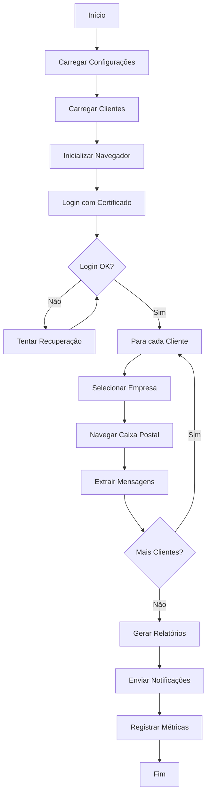

# 🤖 Rob-DET 2.0 - Robô de Automação DET

[](https://www.python.org/downloads/)
[](https://opensource.org/licenses/MIT)
[](https://github.com/psf/black)

> **Robô de automação inteligente para consulta automatizada de mensagens no portal DET (Domicílio Eletrônico Trabalhista)**

Automatize o monitoramento da Caixa Postal DET de múltiplos clientes com certificado digital, notificações em tempo real e relatórios consolidados.

---

## 📋 Índice

- [Visão Geral](#-visão-geral)
- [Características](#-características)
- [Arquitetura](#-arquitetura)
- [Requisitos](#-requisitos)
- [Instalação](#-instalação)
- [Configuração](#-configuração)
- [Uso](#-uso)
- [Testes](#-testes)
- [Troubleshooting](#-troubleshooting)
- [Documentação](#-documentação)
- [FAQ](#-faq)
- [Contribuindo](#-contribuindo)
- [Licença](#-licença)

---

## 🎯 Visão Geral

O **Rob-DET 2.0** é uma solução completa de automação para o portal DET (Domicílio Eletrônico Trabalhista) do Ministério do Trabalho, projetado para escritórios de contabilidade e empresas que precisam monitorar a Caixa Postal de múltiplos CNPJs.

**Portal DET:** https://det.sit.trabalho.gov.br/

### O que o robô faz?

1. 🔐 **Autentica** automaticamente usando certificado digital A1
2. 📨 **Consulta** mensagens de múltiplos clientes via procuração eletrônica
3. 🔍 **Identifica** mensagens novas, urgentes e com prazo próximo
4. 📊 **Gera** relatórios consolidados (Excel, CSV, JSON)
5. 📧 **Notifica** por email sobre mensagens importantes
6. ⏰ **Executa** automaticamente em horários programados
7. 📈 **Monitora** performance com métricas e heartbeat

---

## ✨ Características

### 🚀 Automação Completa

- ✅ **Autenticação Automática** com Certificado Digital A1 (e-CNPJ ou e-CPF)
- ✅ **Auto-seleção de Certificado** via Windows Registry ou PyWinAuto
- ✅ **Multi-Cliente** com suporte a procuração eletrônica
- ✅ **Page Object Model** para navegação robusta
- ✅ **Retry Automático** com backoff exponencial
- ✅ **Recuperação de Falhas** com reinicialização automática

### 📊 Relatórios e Notificações

- ✅ **Relatórios em Múltiplos Formatos**: Excel (5 abas), CSV, JSON
- ✅ **Notificações por Email** (resumo + alertas de urgentes + erros)
- ✅ **Dashboard de Estatísticas** com métricas de performance
- ✅ **Classificação Inteligente** de mensagens (intimação, autuação, etc.)

### ⏰ Agendamento e Monitoramento

- ✅ **Agendamento Flexível** por horário e dia da semana
- ✅ **Windows Task Scheduler** com instalador automático
- ✅ **Heartbeat em Tempo Real** para monitoramento
- ✅ **Métricas de Performance** (taxa de sucesso, tempo médio, etc.)
- ✅ **Logs Rotativos** com compressão automática

### 🛡️ Segurança e Confiabilidade

- ✅ **Screenshots Automáticos** em caso de erro
- ✅ **Validação de Dados** com type hints e dataclasses
- ✅ **Tratamento Robusto de Exceções**
- ✅ **Explicit Waits** para estabilidade
- ✅ **Testes Unitários e de Integração**

---

## 🏗️ Arquitetura

```
Rob-DET-2.0/
├── main.py                      # Script principal
├── config/
│   ├── settings.json           # Configurações gerais
│   ├── settings.json.example   # Template de configuração
│   └── clientes.json           # Lista de clientes (CNPJs)
├── src/
│   ├── models.py               # Modelos de dados
│   ├── config_manager.py       # Gerenciador de configurações
│   ├── det_scraper.py          # Scraper principal DET
│   ├── scheduler.py            # Sistema de agendamento
│   ├── monitoring.py           # Monitoramento e métricas
│   ├── notifications.py        # Notificações por email
│   ├── auth/
│   │   ├── windows_cert_store.py
│   │   └── registry_config.py
│   ├── pages/                  # Page Object Model
│   │   ├── base_page.py
│   │   ├── login_page.py
│   │   ├── home_page.py
│   │   ├── caixa_postal_page.py
│   │   └── mensagem_detalhes_page.py
│   ├── reports/
│   │   └── report_generator.py
│   └── utils/
│       └── retry.py
├── scripts/
│   ├── run_now.py              # Execução manual
│   ├── run_scheduled.py        # Execução agendada
│   ├── install_task_scheduler.py
│   ├── uninstall_task_scheduler.py
│   ├── show_stats.py           # Dashboard de estatísticas
│   ├── list_certificates.py
│   └── setup_auto_certificate.py
├── tests/
│   ├── conftest.py
│   ├── test_models.py
│   ├── test_config_manager.py
│   └── test_integration.py
└── docs/
    ├── MANUAL_USUARIO.md
    ├── TROUBLESHOOTING.md
    └── API.md
```

### Fluxo de Execução



---

## 📦 Requisitos

### Sistema Operacional
- **Windows 10/11** (recomendado para certificados digitais)
- Linux/Mac (experimental, requer configuração adicional)

### Software Necessário
- **Python 3.11 ou superior**
- **Google Chrome** ou **Microsoft Edge** (atualizado)
- **Certificado Digital A1** (e-CNPJ ou e-CPF) válido
- **Procuração Eletrônica** ativa no SPE para CNPJs dos clientes

### Dependências Python

Principais bibliotecas (ver `requirements.txt` completo):

```
selenium==4.15.0          # Automação web
webdriver-manager==4.0.1  # Gerenciamento do ChromeDriver
loguru==0.7.2             # Logging avançado
openpyxl==3.1.2           # Geração de Excel
schedule==1.2.1           # Agendamento
pytest==7.4.3             # Testes
pytest-cov==4.1.0         # Cobertura de testes
rich==13.7.0              # Interface CLI
```

---

## 🚀 Instalação

### 1. Clonar o Repositório

```bash
git clone https://github.com/seu-usuario/Rob-DET-2.0.git
cd Rob-DET-2.0
```

### 2. Criar Ambiente Virtual

```bash
# Windows
python -m venv venv
venv\Scripts\activate

# Linux/Mac
python3 -m venv venv
source venv/bin/activate
```

### 3. Instalar Dependências

```bash
pip install --upgrade pip
pip install -r requirements.txt
```

### 4. Verificar Instalação

```bash
python --version        # Deve ser 3.11+
python -c "import selenium; print(selenium.__version__)"
```

---

## ⚙️ Configuração

### 1. Configurar Certificado Digital

#### Opção A: Auto-seleção via Windows Registry (Recomendado)

```bash
# Listar certificados instalados
python scripts/list_certificates.py

# Configurar auto-seleção
python scripts/setup_auto_certificate.py
```

Isso configurará o Windows Registry para selecionar automaticamente o certificado ao acessar o portal DET.

#### Opção B: PyWinAuto (Fallback)

Se a opção A não funcionar, o robô tentará automaticamente usar PyWinAuto para clicar no certificado.

### 2. Configurar Clientes

Edite `config/clientes.json`:

```json
{
  "clientes": [
    {
      "cnpj": "12.345.678/0001-90",
      "razao_social": "Empresa A Ltda",
      "ativo": true,
      "prioridade": "alta"
    },
    {
      "cnpj": "98.765.432/0001-10",
      "razao_social": "Empresa B Ltda",
      "ativo": true,
      "prioridade": "normal"
    }
  ]
}
```

**Campos:**
- `cnpj`: CNPJ do cliente (com ou sem formatação)
- `razao_social`: Nome da empresa
- `ativo`: `true` para consultar, `false` para ignorar
- `prioridade`: `"alta"`, `"normal"` ou `"baixa"` (ordem de processamento)

### 3. Configurar Settings

Copie o template e edite:

```bash
cp config/settings.json.example config/settings.json
```

Edite `config/settings.json`:

```json
{
  "execucao": {
    "horarios": ["08:00", "14:00", "18:00"],
    "dias_semana": [0, 1, 2, 3, 4],
    "timeout_por_cliente": 180,
    "apenas_nao_lidas": true
  },
  "chrome": {
    "headless": false,
    "download_path": "./downloads"
  },
  "notificacoes": {
    "email_ativo": false,
    "email_servidor": "smtp.gmail.com",
    "email_porta": 587,
    "email_remetente": "seu.email@gmail.com",
    "email_senha": "sua_senha_app",
    "email_destinatarios": ["gestor@empresa.com"]
  },
  "logs": {
    "nivel": "INFO",
    "arquivo": "logs/robo_det.log"
  }
}
```

### 4. Configurar Notificações (Opcional)

Para receber emails automáticos:

1. **Gmail**: Ative verificação em 2 etapas e gere uma [senha de app](https://myaccount.google.com/apppasswords)
2. **Outlook**: Use `smtp-mail.outlook.com:587`
3. Configure em `config/settings.json`:
   - `email_ativo`: `true`
   - `email_remetente`: seu email
   - `email_senha`: senha de app
   - `email_destinatarios`: lista de emails que receberão notificações

---

## 🎮 Uso

### Execução Manual

```bash
# Execução imediata
python main.py

# Ou usando script auxiliar
python scripts/run_now.py
```

### Execução Agendada (Python)

```bash
# Iniciar agendador (fica rodando)
python scripts/run_scheduled.py
```

O agendador executará o robô nos horários configurados em `settings.json`.

### Windows Task Scheduler (Recomendado para Produção)

```bash
# Instalar tarefas agendadas
python scripts/install_task_scheduler.py

# Desinstalar
python scripts/uninstall_task_scheduler.py
```

Após instalar, abra o "Agendador de Tarefas" do Windows e procure por tarefas iniciadas com `RobDET_Exec_*`.

### Ver Estatísticas

```bash
# Dashboard completo
python scripts/show_stats.py
```

Exibe:
- Status do heartbeat (tempo real)
- Estatísticas dos últimos 7 dias
- Estatísticas dos últimos 30 dias
- Configuração atual

---

## 🧪 Testes

### Executar Todos os Testes

```bash
# Todos os testes com cobertura
pytest

# Apenas testes unitários
pytest -m unit

# Apenas testes de integração
pytest -m integration

# Com relatório de cobertura
pytest --cov=src --cov-report=html
```

### Estrutura de Testes

```
tests/
├── conftest.py              # Fixtures compartilhados
├── test_models.py           # Testes de modelos de dados
├── test_config_manager.py   # Testes de configuração
└── test_integration.py      # Testes de integração
```

### Cobertura Atual

```bash
# Ver relatório HTML
python -m http.server 8000 -d htmlcov
# Abra http://localhost:8000
```

---

## 🔧 Troubleshooting

### Erro: Certificado não selecionado

**Problema:** O navegador não seleciona o certificado automaticamente.

**Soluções:**
1. Execute `python scripts/setup_auto_certificate.py` como Administrador
2. Verifique se o certificado está instalado: `python scripts/list_certificates.py`
3. Tente modo não-headless: edite `settings.json` → `chrome.headless: false`

### Erro: Timeout ao carregar página

**Problema:** Página demora muito para carregar.

**Soluções:**
1. Aumente `timeout_por_cliente` em `settings.json`
2. Verifique sua conexão de internet
3. Desative `chrome.disable_images` se estiver ativo

### Erro: CNPJ não encontrado no dropdown

**Problema:** O robô não encontra o CNPJ na lista de empresas.

**Soluções:**
1. Verifique se tem procuração eletrônica ativa para esse CNPJ
2. Acesse o portal manualmente e confirme que o CNPJ aparece
3. Verifique se o CNPJ está correto em `clientes.json`

### Erro: Screenshot não está sendo salvo

**Problema:** Screenshots de erro não aparecem.

**Soluções:**
1. Verifique se a pasta `screenshots/` existe
2. Confirme que `recuperacao.screenshot_em_erro: true` em `settings.json`
3. Verifique permissões de escrita na pasta

### Ver Logs Detalhados

```bash
# Windows PowerShell
Get-Content logs\robo_det.log -Wait -Tail 50

# Linux/Mac
tail -f logs/robo_det.log
```

**Mais soluções:** Veja [docs/TROUBLESHOOTING.md](docs/TROUBLESHOOTING.md)

---

## 📚 Documentação

- **[Manual do Usuário](docs/MANUAL_USUARIO.md)** - Guia completo com exemplos
- **[Troubleshooting](docs/TROUBLESHOOTING.md)** - Soluções para problemas comuns
- **[API Reference](docs/API.md)** - Documentação de classes e métodos
- **[Changelog](CHANGELOG.md)** - Histórico de versões

### Documentação Online

- [Portal DET Oficial](https://det.sit.trabalho.gov.br/)
- [SPE - Sistema de Procuração Eletrônica](https://procuracao.economia.gov.br/spe/)
- [Selenium Documentation](https://www.selenium.dev/documentation/)

---

## ❓ FAQ

### 1. Preciso ter certificado digital para usar o robô?

Sim, é necessário certificado digital A1 (e-CNPJ ou e-CPF) válido. O certificado A3 (token/cartão) não é suportado diretamente pelo Selenium.

### 2. Quantos clientes posso monitorar?

Não há limite técnico. Em testes, o robô processou com sucesso mais de 100 CNPJs em uma execução. O tempo total depende da quantidade de mensagens de cada cliente.

### 3. O robô funciona no Linux/Mac?

Parcialmente. A auto-seleção de certificado via Registry funciona apenas no Windows. No Linux/Mac você precisará configurar manualmente ou usar Wine (experimental).

### 4. Como sei se o robô está funcionando?

1. Ver dashboard: `python scripts/show_stats.py`
2. Verificar heartbeat: `cat logs/heartbeat.json`
3. Ver logs: `tail -f logs/robo_det.log`

### 5. Os relatórios ficam salvos onde?

Por padrão em `relatorios/`, com subpastas por data se configurado. Veja `settings.json` → `relatorios.pasta_saida`.

### 6. Posso executar em modo headless no servidor?

Sim! Configure `chrome.headless: true` em `settings.json`. Útil para executar em servidores sem interface gráfica.

### 7. Como adicionar mais horários de execução?

Edite `settings.json` → `execucao.horarios` e adicione no formato `"HH:MM"`. Depois reinstale no Task Scheduler se usar Windows.

### 8. O robô marca mensagens como lidas?

Não, o robô apenas consulta as mensagens sem alterar o status no portal.

---

## 🤝 Contribuindo

Contribuições são bem-vindas! Por favor:

1. Fork o projeto
2. Crie uma branch para sua feature (`git checkout -b feature/NovaFeature`)
3. Commit suas mudanças (`git commit -m 'Adiciona NovaFeature'`)
4. Push para a branch (`git push origin feature/NovaFeature`)
5. Abra um Pull Request

### Diretrizes

- Siga PEP 8 para estilo de código
- Adicione testes para novas funcionalidades
- Atualize a documentação conforme necessário
- Use type hints em todas as funções

---

## 📄 Licença

Este projeto está sob a licença MIT. Veja o arquivo [LICENSE](LICENSE) para mais detalhes.

---

## 🙏 Agradecimentos

- [Selenium](https://www.selenium.dev/) - Framework de automação web
- [Loguru](https://github.com/Delgan/loguru) - Biblioteca de logging
- [Rich](https://github.com/Textualize/rich) - Interface CLI elegante

---

## 📞 Suporte

- 📧 Email: suporte@exemplo.com
- 💬 Issues: [GitHub Issues](https://github.com/seu-usuario/Rob-DET-2.0/issues)
- 📖 Documentação: [Wiki do Projeto](https://github.com/seu-usuario/Rob-DET-2.0/wiki)

---

**Desenvolvido com ❤️ para automatizar processos trabalhistas**

---

<p align="center">
  <sub>Built with Python • Selenium • Love</sub>
</p>
